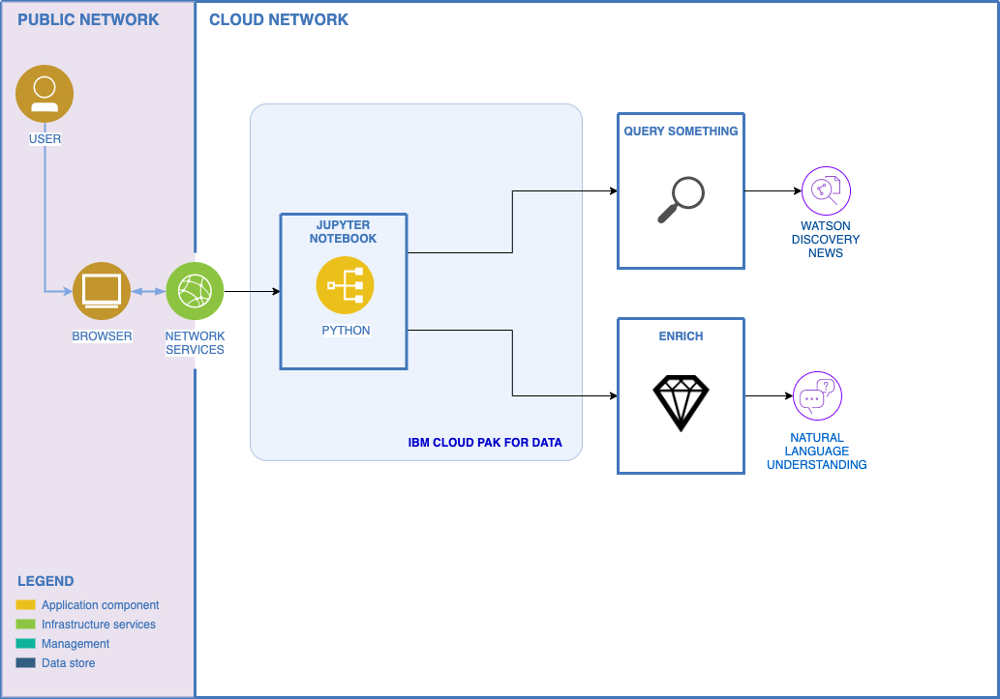

# Use Watson Discovery News to analyze cryptocurrency sentiment

In this example, we will use Watson Discovery News in order to query articles and then we use Watson Natural Language Understanding to obtain extra enrichments for each article.

This could act as a baseline for integrating Watson Discovery into your own application. The use cases are endless, with Watson Discovery, and especially the "news" collection, you can harness the power of advanced queries in order to gain many insights.

## Flow

1. User creates an instance of Watson Discovery and Natural Language Understanding.
2. User run the provided Jupyter notebook with IBM Cloud Pak for Data.
3. The Jupyter notebook leverages Watson Discovery News to retrieve data and Watson Natural Language Understanding for sentiment and keyword extraction.

## Included Components

* [IBM Cloud Pak for Data](https://dataplatform.cloud.ibm.com/)
* [Watson Discovery](https://www.ibm.com/cloud/watson-discovery)
* [Watson Natural Language Understanding](https://www.ibm.com/cloud/watson-natural-language-understanding)

## Featured Technologies

* [Jupyter Notebooks](https://jupyter.org/)

## Steps

### Sign up for IBM Cloud Pak for Data

Sign up for IBM's [IBM Cloud Pak for Data](https://dataplatform.cloud.ibm.com). After signing in, create a new, **basic** project – give it a name, and create a new object storage service if prompted (the **lite** option will work fine).

### Allocate Discovery service

Head over to [IBM Cloud](https://cloud.ibm.com), if prompted, login with the same credentials as above. From the dashboard, click **Create Resource** and search for "*Discovery*" in the catalog. Click on the Discovery card, and click **Create**.

### Allocate Natural Language Understanding service

Head over to [IBM Cloud](https://cloud.ibm.com), if prompted, login with the same credentials as above. From the dashboard, click **Create Resource** and search for "*Natural Language Understanding*" in the catalog. Click on the Natural Language Understanding card, and click **Create**.

### Create Notebook

From Watson Studio, navigate to the project you created previously.
1. In the `Assets` tab, select the `Create notebook` option.
2. Select the `From URL` tab.
3. Enter a name for the notebook.
4. Optionally, enter a description for the notebook.
5. Enter this Notebook URL: https://raw.githubusercontent.com/Fedacc/notebook-discovery-news-nlu-analysis/master/notebooks/discovery-news-nlu-sentiment.ipynb

### Run the notebook

Once the notebook has been created, navigate to the cell with Watson Discovery credentials and enter your own. To find your credentials, navigate to your Discovery service, click on the menu item labeled *Credentials*, generate a new set if none exists yet. Now, you can run the notebook and analyze the results.

## Learn more

* **Data Analytics Code Patterns**: Enjoyed this Code Pattern? Check out our other [Data Analytics Code Patterns](https://developer.ibm.com/technologies/data-science/)
* **With Watson**: Want to take your Watson app to the next level? Looking to utilize Watson Brand assets? [Join the With Watson program](https://www.ibm.com/watson/with-watson/) to leverage exclusive brand, marketing, and tech resources to amplify and accelerate your Watson embedded commercial solution.
* **Watson Studio**: Master the art of data science with IBM's [Watson Studio](https://dataplatform.cloud.ibm.com/)

## License

This code pattern is licensed under the Apache Software License, Version 2.  Separate third party code objects invoked within this code pattern are licensed by their respective providers pursuant to their own separate licenses. Contributions are subject to the [Developer Certificate of Origin, Version 1.1 (DCO)](https://developercertificate.org/) and the [Apache Software License, Version 2](https://www.apache.org/licenses/LICENSE-2.0.txt).

[Apache Software License (ASL) FAQ](https://www.apache.org/foundation/license-faq.html#WhatDoesItMEAN)
